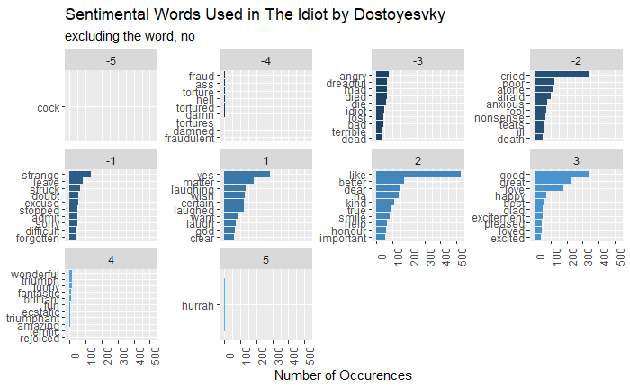

```{r setup, include = FALSE, echo = FALSE}
## data source we will be using for this assignment
library(gutenbergr)

## tidytext
library(tidyverse)
library(tidytext)
library(ggplot2)
library(dplyr)
library(textdata)
library(ggwordcloud)
```

```{r book search, inlcude = FALSE}
## Searching for "The Idiot" by Dostoyevsky -- has id 2638
gutenberg_metadata %>%
  filter(title == "The Idiot" )

```

```{r load book as df, include = FALSE}
## loading The Idiot by Dostoyevsky
el_idiota <- gutenberg_download(2638)

```

```{r splitting words, include = FALSE}
## purpose is to split each word into its own row
el_idiota_words <- el_idiota %>%
  unnest_tokens(word, text)

## printing to check if our goal has been achieved -- yes!
head(el_idiota_words)
  
```

```{r counting words, include = FALSE}
## purpose is to count words and make a df of it
el_idiota_words_count <- el_idiota_words %>%
  anti_join(stop_words, 
            by = "word") %>%
  count(word, 
        sort = TRUE)

## checking to see if our goal was achieved
head(el_idiota_words_count)
str(el_idiota_words)

```

***

In this assignment, we would like to analyze words in The Idiot by Dostoyevsky.
One of the first things we can do is create a column graph of the top 15 words
and their frequencies.

```{r words_visual}
## want to portray most frequent words used in the book
el_idiota_words_count %>%
  slice_max(order_by = n, n = 15) %>%
  ggplot(aes(x = word, y = n)) +
  geom_col(color = "black") +
  scale_x_reordered() +
  labs (title = "Most Frequent Words in The Idiot by Dostoyevsky",
        x = NULL, 
        y = "Word Count") +
  coord_flip()

```

```{r estimate_bing_sentiment}
## generate df with sentiment derived from the Bing dictionary
(el_idiota_bing <- el_idiota_words %>%
   inner_join(get_sentiments("bing")))

```

***

Next, it would also be a good idea to get a sense of sentimental words being
used in the novel. Thus, we will work to visualize negative and positive
words utilized in the novel using the Bing Dictionary.

```{r visualizing_bing_sentiment}
## visualize the most frequent positive/negative words in the entire book
## using the Bing dictionary
el_idiota_bing %>%
  group_by(sentiment) %>%
  count(word) %>%
  group_by(sentiment) %>%
  slice_max(order_by = n, n = 10) %>%
  mutate(word = reorder_within(word, n, sentiment)) %>%
  ggplot(aes(word, n, fill = sentiment)) +
  geom_col(show.legend = FALSE) +
  scale_x_reordered() +
  facet_wrap(facets = vars(sentiment), scales = "free_y") +
  labs(title = "Sentimental Words Used in The Idiot by Dostoyesvky",
       x = NULL, 
       y = "Number of Occurences") +
  coord_flip()

```

***

```{r estimate_AFINN_sentiment}
## generate df with sentiment derived from the AFINN sentiment dictionary
(el_idiota_afinn <- el_idiota_words %>% 
   inner_join(get_sentiments("afinn")))

```

Moving forward, let us now use a different text sentiment source, AFINN.
Thus, now we are able to get a wider range of sentiment values related to words.
This AFINN source analyze words within text and places values ranging from 
-5 to 5, thus allowing for a wider spread and nuance of words being used in the novel, The Idiot. 

***


Let's now visualize words and their associated sentiment AFINN values, thus allowing us to further visualize word use in The Idiot.

```{r visualize_AFINN_sentiment, include = TRUE, eval = TRUE}
## visualize the most frequent positive/negative words in the entire book
## using the afinn sentiment dictionary
el_idiota_afinn %>%
  filter(word != "no") %>%
  group_by(value) %>%
  count(word) %>%
  group_by(value) %>%
  slice_max(order_by = n, n = 10) %>%
  mutate(word = reorder_within(word, n, value)) %>%
  ggplot(aes(word, n, fill = value)) +
  geom_col(show.legend = FALSE) +
  scale_x_reordered() +
  facet_wrap(facets = vars(value), scales = "free_y") +
  labs(title = "Sentimental Words Used in The Idiot by Dostoyesvky",
       subtitle = "excluding the word, no",
       x = NULL, 
       y = "Number of Occurences") +
  theme(axis.text.x = element_text(angle = 90)) +
  coord_flip()


```

*incase code chunk does not portray figure




***

Being able to find nuances within the text is important as it allows us to 
really go in depth into word usage and its associated sentiment. But what if
we would like to just get a general idea of word sentiment usage overall?
We can aim to visualize this below in a bar graph. As can be seen, there seems to
exist a pretty equal quantity of negative and positive word usage in The Idiot.
It can be estimated that overall there is more negative word usage however, via
the graph below.

```{r visualizing_afinn_sentiment_overall}
## want to give a general visualization of sentiment scores overall
el_idiota_afinn %>%
  ggplot(aes(x = value)) +
  geom_bar() +
  labs(title = "Aggregate AFINN Values in The Idiot by Dostoyevsky",
       x = "AFINN Sentiment Value",
       y = "Word Count")

```

***

Lastly, let us create a word cloud of the top 50 words used in the Novel.

```{r wordcloud_afinn_sentiment}
## visualize which words in the AFINN sentiment dictionary appear most
set.seed(420)

el_idiota_afinn %>% 
  count(word) %>%
  slice_max(order_by = n, n = 100) %>%
  mutate(angle = 90 * sample(c(0, 1), n(), replace = TRUE, prob = c(70, 30))) %>%
  ggplot(aes(label = word, size = n, angle = angle)) +
  geom_text_wordcloud(rm_outside = TRUE) +
  scale_size_area(max_size = 15) +
  ggtitle("Most Frequent Tokens in The Idiot") +
  theme_minimal()

```

