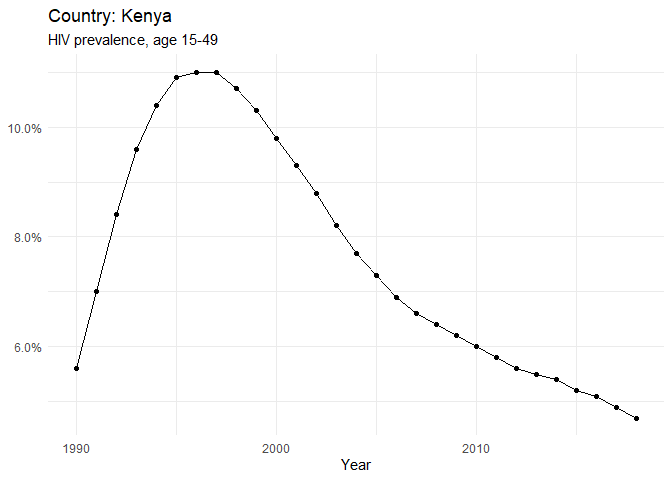
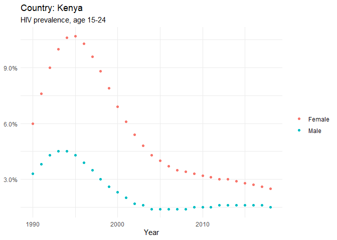
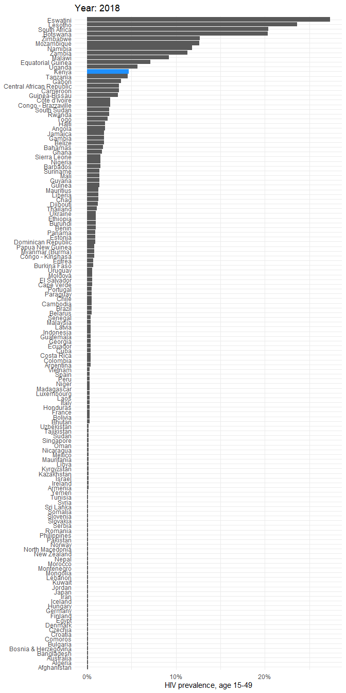

Country Profile
================

  - [Data](#data)
  - [Country Report: Kenya](#country-report-kenya)

# Data

The file `hiv_rates.csv` contains a tidy dataset with six columns:

1.  The ISO3 code of the country that reported data.
2.  The year for which data was reported.
3.  The percentage of HIV-positive individuals age 15-49.
4.  The percentage of HIV-positive females age 15-24.
5.  The percentage of HIV-positive males age 15-24.

# Country Report: Kenya

For which years do we have data for Kenya?

    ##    year
    ## 1  1990
    ## 2  1991
    ## 3  1992
    ## 4  1993
    ## 5  1994
    ## 6  1995
    ## 7  1996
    ## 8  1997
    ## 9  1998
    ## 10 1999
    ## 11 2000
    ## 12 2001
    ## 13 2002
    ## 14 2003
    ## 15 2004
    ## 16 2005
    ## 17 2006
    ## 18 2007
    ## 19 2008
    ## 20 2009
    ## 21 2010
    ## 22 2011
    ## 23 2012
    ## 24 2013
    ## 25 2014
    ## 26 2015
    ## 27 2016
    ## 28 2017
    ## 29 2018

How has HIV incidence changed over time in Kenya?

<!-- --><!-- -->

How does Kenya compare in 2018?

<!-- -->
