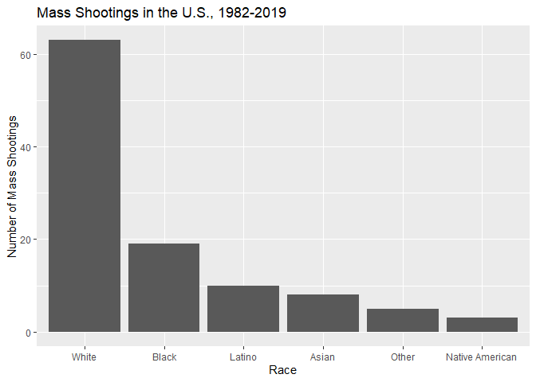
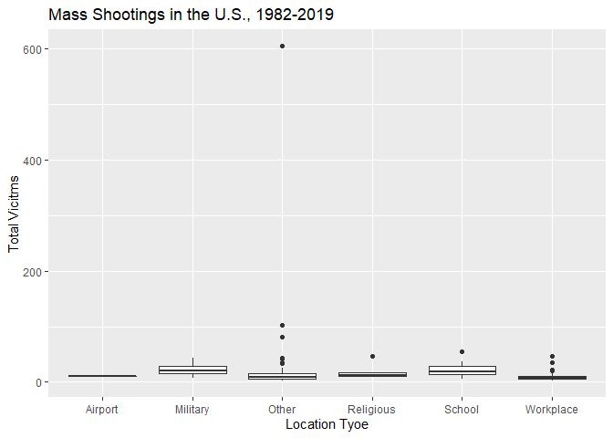
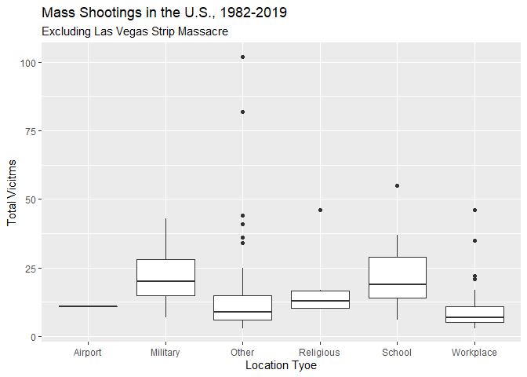
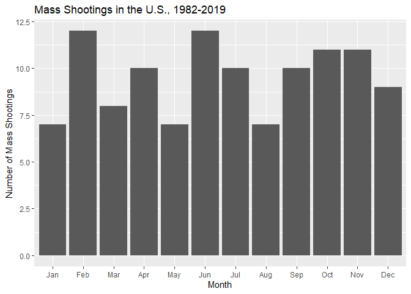
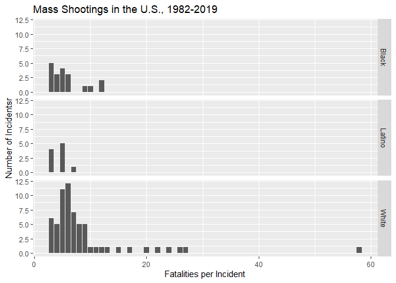
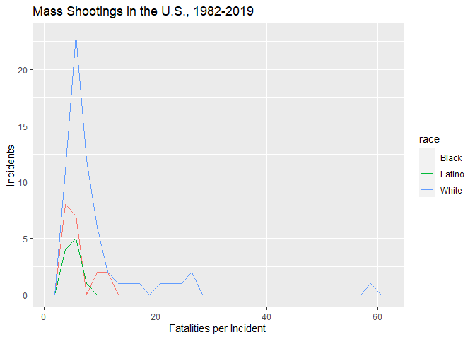
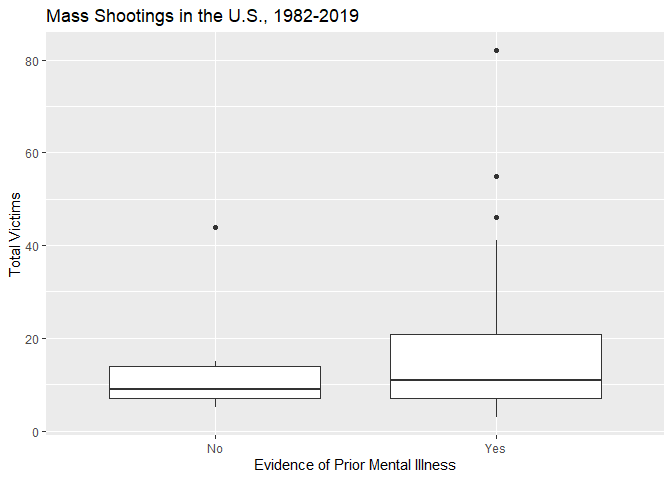
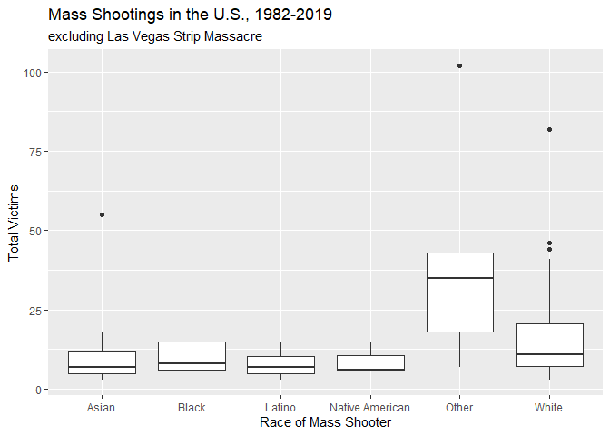
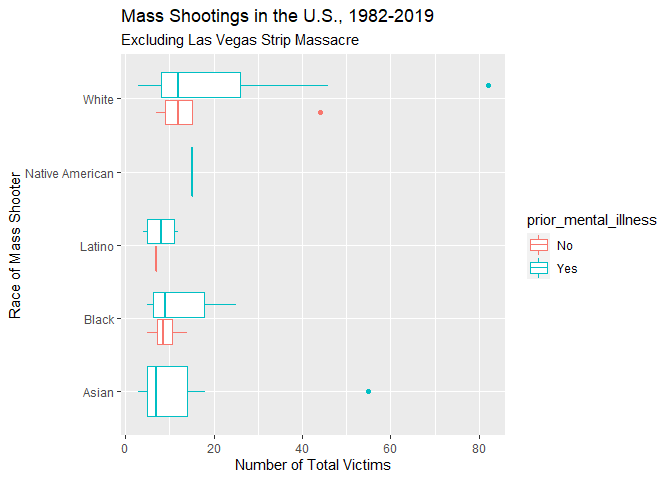

Exploring Mass Shootings in America
================
Angel Salazar

## Get the data

``` r
library(tidyverse)    # load tidyverse packages, including ggplot2
```

    ## Warning: package 'tidyverse' was built under R version 4.0.5

    ## -- Attaching packages --------------------------------------- tidyverse 1.3.1 --

    ## v ggplot2 3.3.5     v purrr   0.3.4
    ## v tibble  3.1.4     v dplyr   1.0.7
    ## v tidyr   1.1.3     v stringr 1.4.0
    ## v readr   2.0.1     v forcats 0.5.1

    ## Warning: package 'ggplot2' was built under R version 4.0.5

    ## Warning: package 'tibble' was built under R version 4.0.5

    ## Warning: package 'tidyr' was built under R version 4.0.5

    ## Warning: package 'readr' was built under R version 4.0.5

    ## Warning: package 'dplyr' was built under R version 4.0.5

    ## Warning: package 'forcats' was built under R version 4.0.5

    ## -- Conflicts ------------------------------------------ tidyverse_conflicts() --
    ## x dplyr::filter() masks stats::filter()
    ## x dplyr::lag()    masks stats::lag()

``` r
library(knitr)        # load functions for formatting tables
library(dplyr)

# get data from rcfss package
# install latest version if not already installed
# devtools::install_github("uc-cfss/rcfss")
library(rcfss)

# data("mass_shootings")
mass_shootings# 
```

    ## # A tibble: 114 x 14
    ##    case     year month   day location summary   fatalities injured total_victims
    ##    <chr>   <dbl> <chr> <int> <chr>    <chr>          <dbl>   <dbl>         <dbl>
    ##  1 Dayton~  2019 Aug       4 Dayton,~ "PENDING"          9      27            36
    ##  2 El Pas~  2019 Aug       3 El Paso~ "PENDING"         20      26            46
    ##  3 Gilroy~  2019 Jul      28 Gilroy,~ "Santino~          3      12            15
    ##  4 Virgin~  2019 May      31 Virgini~ "DeWayne~         12       4            16
    ##  5 Harry ~  2019 Feb      15 Aurora,~ "Gary Ma~          5       6            11
    ##  6 Pennsy~  2019 Jan      24 State C~ "Jordan ~          3       1             4
    ##  7 SunTru~  2019 Jan      23 Sebring~ "Zephen ~          5       0             5
    ##  8 Mercy ~  2018 Nov      19 Chicago~ "Juan Lo~          3       0             3
    ##  9 Thousa~  2018 Nov       7 Thousan~ "Ian Dav~         12      22            34
    ## 10 Tree o~  2018 Oct      27 Pittsbu~ "Robert ~         11       6            17
    ## # ... with 104 more rows, and 5 more variables: location_type <chr>,
    ## #   male <lgl>, age_of_shooter <dbl>, race <chr>, prior_mental_illness <chr>

# Very Specific Prompts

## \[1\] Generate a data frame that summarizes the number of mass shootings per year. Print the data frame as a formatted `kable()` table.

``` r
x <- mass_shootings %>%
  group_by(year) %>%
  summarize(num_shootings = length(year))

kable(x, col.names = c("Year", "Number of Shootings"), 
      caption = "Mass Shootings, 1982 - 2019")
```

| Year | Number of Shootings |
| ---: | ------------------: |
| 1982 |                   1 |
| 1984 |                   2 |
| 1986 |                   1 |
| 1987 |                   1 |
| 1988 |                   1 |
| 1989 |                   2 |
| 1990 |                   1 |
| 1991 |                   3 |
| 1992 |                   2 |
| 1993 |                   4 |
| 1994 |                   1 |
| 1995 |                   1 |
| 1996 |                   1 |
| 1997 |                   2 |
| 1998 |                   3 |
| 1999 |                   5 |
| 2000 |                   1 |
| 2001 |                   1 |
| 2003 |                   1 |
| 2004 |                   1 |
| 2005 |                   2 |
| 2006 |                   3 |
| 2007 |                   4 |
| 2008 |                   3 |
| 2009 |                   4 |
| 2010 |                   1 |
| 2011 |                   3 |
| 2012 |                   7 |
| 2013 |                   5 |
| 2014 |                   4 |
| 2015 |                   7 |
| 2016 |                   6 |
| 2017 |                  11 |
| 2018 |                  12 |
| 2019 |                   7 |

Mass Shootings, 1982 - 2019

## \[2\] Generate a bar chart that identifies the number of mass shooters associated with each race category. The bars should be sorted from highest to lowest.

``` r
# this is attempt two using gplot
clean_data_race_na <- filter(mass_shootings, !is.na(race))

ggplot(data = clean_data_race_na, 
       aes(x = reorder(race, race, function(x) -length(x)))) + 
  geom_bar() +
  labs(x = "Race", 
       y = "Number of Mass Shootings", 
       title = "Mass Shootings in the U.S., 1982-2019")
```

<!-- -->

## \[3\] Generate a boxplot visualizing the number of total victims, by type of location. Redraw the same plot, but remove the Las Vegas Strip massacre from the dataset.

``` r
# process to exclude las vegas strip massacre
mydata_exclusion_LVS <- mass_shootings[-c(24),]

# including LVS massacre
ggplot(data = mass_shootings, 
       aes(x = location_type, y = total_victims)) + 
  geom_boxplot() + 
  labs(x = "Location Tyoe", 
       y = "Total Vicitms", 
       title = "Mass Shootings in the U.S., 1982-2019")
```

<!-- -->

``` r
# excluding LVS massacre
ggplot(data = mydata_exclusion_LVS, 
       aes(x = location_type, y = total_victims)) + 
  geom_boxplot() + 
  labs(x = "Location Tyoe", 
       y = "Total Vicitms", 
       title = "Mass Shootings in the U.S., 1982-2019",
       subtitle = "Excluding Las Vegas Strip Massacre")
```

<!-- -->

# More Open-Ended Questions

## \[1\] How many white males with prior signs of mental illness initiated a mass shooting after 2000?

``` r
# after so much struggling, this is the ultimate code that does everything in one
# yaaaay
newdata_mentally_ill_white_male_gen_z <- filter(mass_shootings, 
                                               year > "2000",
                                               race == "White",
                                               prior_mental_illness == "Yes",
                                               male == TRUE)

# counting how many rows there is in the newly created data set
# which has been reduced to white males with prior mental illness
A <- nrow(newdata_mentally_ill_white_male_gen_z)
A
```

    ## [1] 20

*20 white males with prior signs of mental illness initiated a mass
shooting after 2000*

## \[2\] Which month of the year has the most mass shootings? Generate a bar chart sorted in chronological order to provide evidence of your answer.

``` r
ggplot(data = mass_shootings, aes(x = month,)) + geom_bar() + 
  scale_x_discrete(limits = month.abb) +
  labs(x = "Month", 
       y = "Number of Mass Shootings", 
       title = "Mass Shootings in the U.S., 1982-2019")
```

<!-- -->

*February and June are the months of the year with the most mass
shootings as can be seen from the included bar chart*

## \[3\] How does the distribution of mass shooting fatalities differ between white and black shooters? What about white and latino shooters?

``` r
# best way would be to exclude any other races then run what I have below
data_black_latino_white <- filter(mass_shootings,
                                  race %in% c("Black", "White", "Latino"))

# figure 1
ggplot(data = data_black_latino_white, 
       aes(x = fatalities)) + 
  geom_bar() + 
  facet_grid(rows = vars(race)) +
  labs(x = "Fatalities per Incident", 
       y = "Number of Incidentsr", 
       title = "Mass Shootings in the U.S., 1982-2019")
```

<!-- -->

``` r
# figure 2
ggplot(data = data_black_latino_white, 
       aes(x = fatalities, group = race, color = race)) + 
  geom_freqpoly() +
  labs(x = "Fatalities per Incident", 
       y = "Incidents", 
       title = "Mass Shootings in the U.S., 1982-2019")
```

    ## `stat_bin()` using `bins = 30`. Pick better value with `binwidth`.

<!-- -->

*As can be seen from the included figures, white people tend to kill
more people* *whenever they shoot up places in order to massacre
others.* *Overall, both Black and Brown folk have not killed over 20
people whenever they* *decide to shoot up places.* *Moreover, white
people are numerically the race that tend to do mass shootings.* *Next
would be Black people and lastly, Latino people.* *The difference
between both black and latino people and white people is* *significant
in terms of incidents.*

# Very Open-Ended

## \[1\] Are mass shootings with shooters suffering from mental illness different from mass shootings with no signs of mental illness in the shooter? Assess the relationship between mental illness and total victims, mental illness and race, and the intersection of all three variables.

Answer: In cases where a mass shooter has prior mental illness
indicators, more people die. Thus, it can be surmised that people with
prior mental illness will kill more people than people with no prior
mental illness. On average, white people mass shootings have more total
victims than other races (excluding other). It would seem okay to assume
that most people documented with prior mental illness indicators are
white. Overall though, most mass shooters tend to be white. We would
need more data to explore relationship between mental illness and race
in my view. Overall, as can be summarized by the third boxplot figure,
showing indications of mental illness can be related to higher total
victims. Incidents where the shooter is white may indicate higher total
victims on average. Lastly, irrespective of race, mental illness will be
highly likely than not in terms of who is doing the mass shooting.

``` r
# create data that excludes cases of NA in prior mental ilness
data_exclude_mental_illness_na <- filter(mass_shootings, 
                                      !is.na(prior_mental_illness))

# assessing the relationship between mental illness and total victims
ggplot(data = data_exclude_mental_illness_na,
       aes(x = prior_mental_illness, y = total_victims)) +
  geom_boxplot() + 
  labs(x = "Evidence of Prior Mental Illness", 
       y = "Total Victims", 
       title = "Mass Shootings in the U.S., 1982-2019")
```

<!-- -->

``` r
# Assessing relationship between mental illness and race
ggplot(data = filter(mydata_exclusion_LVS, !is.na(race)),
       aes(x = race, y = total_victims)) +
  geom_boxplot() +
  labs(x = "Race of Mass Shooter", 
       y = "Total Victims", 
       title = "Mass Shootings in the U.S., 1982-2019",
       subtitle = "excluding Las Vegas Strip Massacre")
```

<!-- -->

``` r
# assessing all three 
# need data that omits race NA, mental_illness NA
data_race_prior_mental_illness_cleanup <- filter(mass_shootings, 
                                                 !is.na(race),
                                                 !is.na(prior_mental_illness))

ggplot(data = data_race_prior_mental_illness_cleanup, 
       aes(x = total_victims, y = race, 
       color = prior_mental_illness)) + geom_boxplot() +
  labs(x = "Number of Total Victims", 
       y = "Race of Mass Shooter", 
       title = "Mass Shootings in the U.S., 1982-2019",
       subtitle = "Excluding Las Vegas Strip Massacre")
```

<!-- -->

## Session info

``` r
devtools::session_info()
```

    ## - Session info ---------------------------------------------------------------
    ##  setting  value                       
    ##  version  R version 4.0.3 (2020-10-10)
    ##  os       Windows 10 x64              
    ##  system   x86_64, mingw32             
    ##  ui       RTerm                       
    ##  language (EN)                        
    ##  collate  English_United States.1252  
    ##  ctype    English_United States.1252  
    ##  tz       America/Chicago             
    ##  date     2021-10-12                  
    ## 
    ## - Packages -------------------------------------------------------------------
    ##  package     * version date       lib source                        
    ##  assertthat    0.2.1   2019-03-21 [1] CRAN (R 4.0.3)                
    ##  backports     1.2.1   2020-12-09 [1] CRAN (R 4.0.3)                
    ##  broom         0.7.9   2021-07-27 [1] CRAN (R 4.0.5)                
    ##  cachem        1.0.6   2021-08-19 [1] CRAN (R 4.0.5)                
    ##  callr         3.7.0   2021-04-20 [1] CRAN (R 4.0.5)                
    ##  cellranger    1.1.0   2016-07-27 [1] CRAN (R 4.0.5)                
    ##  cli           3.0.1   2021-07-17 [1] CRAN (R 4.0.5)                
    ##  colorspace    2.0-2   2021-06-24 [1] CRAN (R 4.0.5)                
    ##  crayon        1.4.1   2021-02-08 [1] CRAN (R 4.0.5)                
    ##  DBI           1.1.1   2021-01-15 [1] CRAN (R 4.0.5)                
    ##  dbplyr        2.1.1   2021-04-06 [1] CRAN (R 4.0.5)                
    ##  desc          1.4.0   2021-09-28 [1] CRAN (R 4.0.3)                
    ##  devtools      2.4.2   2021-06-07 [1] CRAN (R 4.0.5)                
    ##  digest        0.6.27  2020-10-24 [1] CRAN (R 4.0.5)                
    ##  dplyr       * 1.0.7   2021-06-18 [1] CRAN (R 4.0.5)                
    ##  ellipsis      0.3.2   2021-04-29 [1] CRAN (R 4.0.5)                
    ##  evaluate      0.14    2019-05-28 [1] CRAN (R 4.0.3)                
    ##  fansi         0.5.0   2021-05-25 [1] CRAN (R 4.0.5)                
    ##  farver        2.1.0   2021-02-28 [1] CRAN (R 4.0.5)                
    ##  fastmap       1.1.0   2021-01-25 [1] CRAN (R 4.0.5)                
    ##  forcats     * 0.5.1   2021-01-27 [1] CRAN (R 4.0.5)                
    ##  fs            1.5.0   2020-07-31 [1] CRAN (R 4.0.5)                
    ##  generics      0.1.0   2020-10-31 [1] CRAN (R 4.0.3)                
    ##  ggplot2     * 3.3.5   2021-06-25 [1] CRAN (R 4.0.5)                
    ##  glue          1.4.2   2020-08-27 [1] CRAN (R 4.0.3)                
    ##  gtable        0.3.0   2019-03-25 [1] CRAN (R 4.0.3)                
    ##  haven         2.4.3   2021-08-04 [1] CRAN (R 4.0.5)                
    ##  highr         0.9     2021-04-16 [1] CRAN (R 4.0.5)                
    ##  hms           1.1.1   2021-09-26 [1] CRAN (R 4.0.3)                
    ##  htmltools     0.5.2   2021-08-25 [1] CRAN (R 4.0.5)                
    ##  httr          1.4.2   2020-07-20 [1] CRAN (R 4.0.5)                
    ##  jsonlite      1.7.2   2020-12-09 [1] CRAN (R 4.0.3)                
    ##  knitr       * 1.35    2021-09-28 [1] CRAN (R 4.0.3)                
    ##  labeling      0.4.2   2020-10-20 [1] CRAN (R 4.0.3)                
    ##  lifecycle     1.0.1   2021-09-24 [1] CRAN (R 4.0.3)                
    ##  lubridate     1.7.10  2021-02-26 [1] CRAN (R 4.0.5)                
    ##  magrittr      2.0.1   2020-11-17 [1] CRAN (R 4.0.3)                
    ##  memoise       2.0.0   2021-01-26 [1] CRAN (R 4.0.5)                
    ##  modelr        0.1.8   2020-05-19 [1] CRAN (R 4.0.5)                
    ##  munsell       0.5.0   2018-06-12 [1] CRAN (R 4.0.3)                
    ##  pillar        1.6.3   2021-09-26 [1] CRAN (R 4.0.3)                
    ##  pkgbuild      1.2.0   2020-12-15 [1] CRAN (R 4.0.3)                
    ##  pkgconfig     2.0.3   2019-09-22 [1] CRAN (R 4.0.3)                
    ##  pkgload       1.2.2   2021-09-11 [1] CRAN (R 4.0.5)                
    ##  prettyunits   1.1.1   2020-01-24 [1] CRAN (R 4.0.3)                
    ##  processx      3.5.2   2021-04-30 [1] CRAN (R 4.0.5)                
    ##  ps            1.6.0   2021-02-28 [1] CRAN (R 4.0.5)                
    ##  purrr       * 0.3.4   2020-04-17 [1] CRAN (R 4.0.3)                
    ##  R6            2.5.1   2021-08-19 [1] CRAN (R 4.0.5)                
    ##  rcfss       * 0.2.1   2021-10-07 [1] Github (uc-cfss/rcfss@5b60f61)
    ##  Rcpp          1.0.7   2021-07-07 [1] CRAN (R 4.0.5)                
    ##  readr       * 2.0.1   2021-08-10 [1] CRAN (R 4.0.5)                
    ##  readxl        1.3.1   2019-03-13 [1] CRAN (R 4.0.5)                
    ##  remotes       2.4.0   2021-06-02 [1] CRAN (R 4.0.5)                
    ##  reprex        2.0.1   2021-08-05 [1] CRAN (R 4.0.5)                
    ##  rlang         0.4.11  2021-04-30 [1] CRAN (R 4.0.5)                
    ##  rmarkdown     2.11    2021-09-14 [1] CRAN (R 4.0.5)                
    ##  rprojroot     2.0.2   2020-11-15 [1] CRAN (R 4.0.3)                
    ##  rstudioapi    0.13    2020-11-12 [1] CRAN (R 4.0.3)                
    ##  rvest         1.0.1   2021-07-26 [1] CRAN (R 4.0.5)                
    ##  scales        1.1.1   2020-05-11 [1] CRAN (R 4.0.3)                
    ##  sessioninfo   1.1.1   2018-11-05 [1] CRAN (R 4.0.5)                
    ##  stringi       1.7.4   2021-08-25 [1] CRAN (R 4.0.5)                
    ##  stringr     * 1.4.0   2019-02-10 [1] CRAN (R 4.0.3)                
    ##  testthat      3.0.4   2021-07-01 [1] CRAN (R 4.0.5)                
    ##  tibble      * 3.1.4   2021-08-25 [1] CRAN (R 4.0.5)                
    ##  tidyr       * 1.1.3   2021-03-03 [1] CRAN (R 4.0.5)                
    ##  tidyselect    1.1.1   2021-04-30 [1] CRAN (R 4.0.5)                
    ##  tidyverse   * 1.3.1   2021-04-15 [1] CRAN (R 4.0.5)                
    ##  tzdb          0.1.2   2021-07-20 [1] CRAN (R 4.0.5)                
    ##  usethis       2.0.1   2021-02-10 [1] CRAN (R 4.0.5)                
    ##  utf8          1.2.2   2021-07-24 [1] CRAN (R 4.0.5)                
    ##  vctrs         0.3.8   2021-04-29 [1] CRAN (R 4.0.5)                
    ##  withr         2.4.2   2021-04-18 [1] CRAN (R 4.0.5)                
    ##  xfun          0.24    2021-06-15 [1] CRAN (R 4.0.5)                
    ##  xml2          1.3.2   2020-04-23 [1] CRAN (R 4.0.5)                
    ##  yaml          2.2.1   2020-02-01 [1] CRAN (R 4.0.3)                
    ## 
    ## [1] C:/Users/aange/OneDrive/Documents/R/win-library/4.0
    ## [2] C:/Program Files/R/R-4.0.3/library
